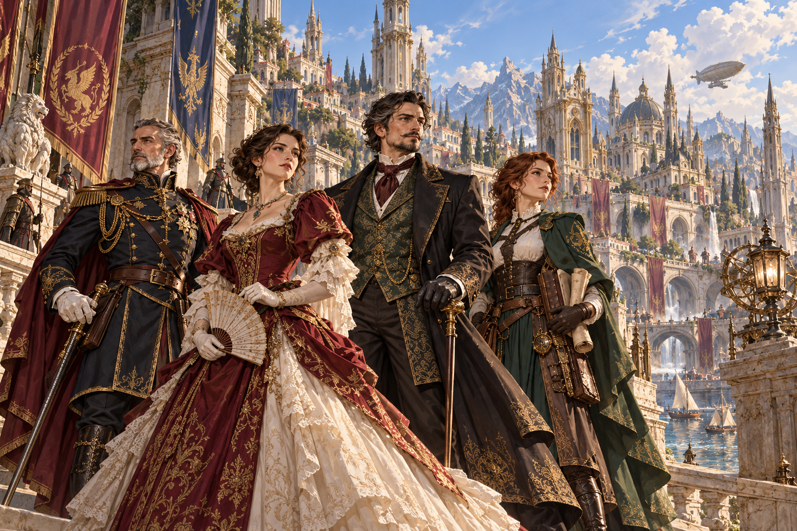

# **Humans**

## **Overview**

There is no single human civilization.

Human kingdoms differ in nearly every way imaginable. One may be ruled by a hereditary monarch, another by an elected assembly, and a third by institutions that would be unrecognizable to either. Their customs, laws, values, and political traditions can change dramatically within only a few generations.

Human societies rarely remain unchanged for long. Five human kingdoms may stand beside one another and still produce five entirely different cultures.

## **The Human Body**

Humans possess few extreme natural advantages. They are neither especially large nor small, neither naturally strong nor particularly frail, and their physical traits vary greatly between populations. Roughly **one in twenty humans** is capable of becoming a Praedari.

Most humans live between **seventy and ninety years**, though some reach a century. Powerful Praedari can live considerably longer, depending on how far their mana cultivation develops.

Compared with many other peoples of Avara, the human body is remarkably ordinary. Yet that has never stopped humanity from becoming the most populous people on the continent.

## **The Middle Ground**

Humans are competent in almost everything, yet they rarely possess the natural gifts other peoples are born with. They do not have the strength of Goliaths, the longevity of elves, the uncanny fortune of halflings, or many of the other traits that distinguish the peoples of Avara.

Humanity is well aware of this.

That awareness has shaped them for generations. Humans train where others rely on instinct, study what others inherit naturally, and borrow whatever techniques proven useful. What they lack in natural specialization, they often compensate for through effort, imitation, and a strong sense of pragmatism.

If another race possesses an advantage humanity does not, humans rarely spend long mourning the difference. They learn from it and take what they can. All in the name of survival, and perhaps one day to thrive as the pioneers of Avara.

## **Adaptability**

Humanity's greatest natural strength is adaptability.

Humans can settle across almost every region of Avara, and over generations their societies reshape themselves around the places they inhabit. A kingdom built along great rivers will develop differently from one surrounded by mountains. A wealthy trading state will think differently from a nation trapped between stronger neighbors. Geography, enemies, resources, and opportunity all leave their mark.

Humanity therefore possesses no single fixed way of life. They adapt until their culture fits the world around them, and when that world changes, they change with it.

This ability can make human societies difficult to define from the outside. Customs considered sacred in one century may be abandoned in the next, while ideas borrowed from former enemies can eventually become traditions defended as though they had always existed.

For humans, survival has rarely required remaining the same.

## **Numbers**

Humanity's greatest practical advantage is its population.

Their fertility, combined with their ability to settle a wide range of environments, has allowed humans to spread across much of Avara. Even where individual human kingdoms rise and fall, humanity itself remains difficult to dislodge.

Large populations provide obvious advantages: more soldiers, more workers, more craftsmen, more scholars, and more people capable of filling whatever role a society requires. But numbers provide humanity with something else as well.

More chances.

Humans do not need every person among them to be extraordinary. They can produce millions of ordinary people and wait for the rare individual who is not. A brilliant commander, a powerful Praedari, or a scholar who discovers something no one before them understood.

Humanity needs only one such person to emerge among millions, and once they do, there are millions others following what that person begins.

## **Human Alliances**

Human kingdoms frequently form alliances with one another, and this too can be seen as another expression of their adaptability. Humans are often willing to cooperate when cooperation offers the better chance of survival.

Such alliances are rarely permanent.

Two kingdoms that spent generations fighting over a border may suddenly stand together when a greater threat appears. Old insults are set aside, treaties are signed, armies march beneath neighboring banners, and rulers who once despised one another discover reasons to speak politely.

Once the threat disappears, however, both kingdoms may soon return to aiming at each other's throats. Human alliances are often built less upon affection than necessity, but necessity has proven more than enough to unite them when circumstances demand it.

## **The Human Contradiction**

Humans live beside races who often seem naturally better suited to particular tasks, yet humanity can be found almost everywhere in Avara.

Human kingdoms collapse and new ones rise from their remains. Conquered peoples adopt the methods of their conquerors, then reshape those methods into something of their own. Foreign disciplines become local traditions. Cities destroyed by war are rebuilt, sometimes by the grandchildren of those who watched them burn.

Humanity possesses no single ideal form it must preserve, and that is both its strength and its weakness. Humans change quickly, governments, religions, customs, military traditions, and even entire identities can transform within a handful of generations.

Other races may look upon that constant change as instability. Humans often call it survival. They are rarely the people naturally best suited to whatever must be done.

But they are remarkably good at becoming what the world demands.
