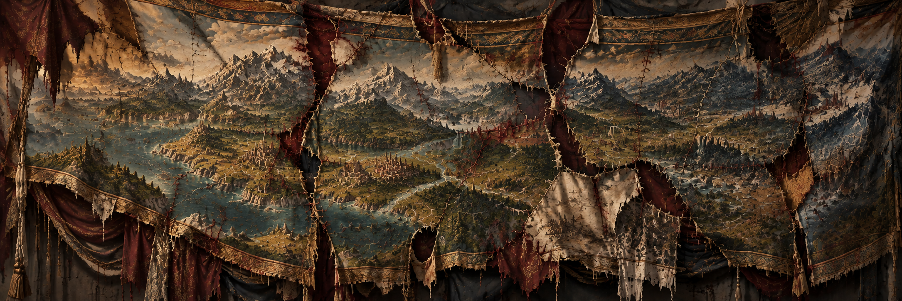

  
  
A continent divided.<a href="#avara">Enter the world ↓</a>

The world chronicle

# Avara
---
**A Continent of Many Powers**

Avara is a vast continent of rival kingdoms, distinct races, and many unfinished disputes. Race and blood remain as the deepest wedge dividing one person from another. Never in its history has the continent known a single unified realm, many have tried and all have failed.

Numerous Human kingdoms, elven states, dwarven holds, and orc tribes have risen across the land only to fall in turn. Everyday the borders shift, old rulers are cast down as new ones rise to inherit the same ambitions left behind by those who came before them.

Thousands of thrones harbor ambitions to rule the land. Treaties may quiet a border for a time, but they cannot erase the past. Everyone remembers what was taken from them, and grief has always found a way to linger in the minds of the living, long after the demise of their forefathers.

Every ruler inherits a map covered in unfinished ambitions. Each believes they stand on the right side of history. Many claim they can hear the land itself yearning to be united beneath a single banner. At night, when they finally closed their eyes, they dreamed of glory, prestige, and the immortality promised by victory on the battlefield.

Yet beneath those glamorous dreams, something haunted the mind that bears a crown, It follows quietly, patiently, and persistently. Fear that has given rulers across the generations a whisper: **If you do not draw the first blood, then you will be the one who bleeds.**

And so millions of soldiers march throughout the lands.

They march as they kill, burning everything in their path. One soldier kills for glory and pride, while beside him his companion drags a civilian by the hair, seeking to sate an anger that was inherited from those who came before. Others kill in the names of their gods, offering lives as tribute to the divine. In the end, the reason matters little to those caught beneath it. Whatever banners are raised and whatever legitimacy are spoken, it is the innocent who are always made to pay the price.

The fate of the conquered rests entirely upon the whims of the victorious. Across the land, countless innocents have questioned the heavens as they drew their final breath, searching for some meaning or reason behind the fate that had befallen them. The one who survived found a life that is worse than death. Eyes that have lost the flicker of hope can be found throughout the entire land, for all they can see are chains on their hands and feet as they are forced to walk by a man holding a whip. 

**This is Avara.**

A continent of peoples united beneath their own banners and divided against all who stand beyond them. Yet when every hope of peace seems spent, one empire looks upon this endless division and sees something greater than dream or ambition.

**It sees responsibility upon the land.** Avara must be united beneath one law, one crown, and a single throne standing above all others. So the armies of the Empire march, and the enemy kingdoms prepare for invasion. Walls are strengthened, armies assembled, and every road is watched for the first Imperial banners. When the Empire finally comes into view, they are confronted by something they did not expect.

The banners of the Empire are carried upright by soldiers trained for war since they were teenagers. The sound of Imperial armies approaches, thousands of boots striking the road in an inhumanlike unison. Humans, elves, dwarves, and many other races march side by side beneath the same banners, preparing to conquer a kingdom that once believed such unity is impossible.

Many other rulers see the empire as an abomination, a manifestation of everything that is wrong about the world. Their machinery changes the laws of nature, they steal everything that is useful and claim those were always theirs. Traditions that have spanned thousands of years will be erased without a trace once the empire deemed it useless.

The Empire has looked upon the vast land stretched before it. The continent has been measured and it has been weighed. To bring Avara beneath a single order and guide it toward its first age of peace is a responsibility the Empire believes only it alone can bear.

Many call it arrogance.

**The Empire calls it destiny.**

